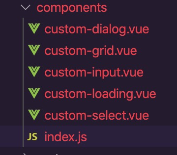
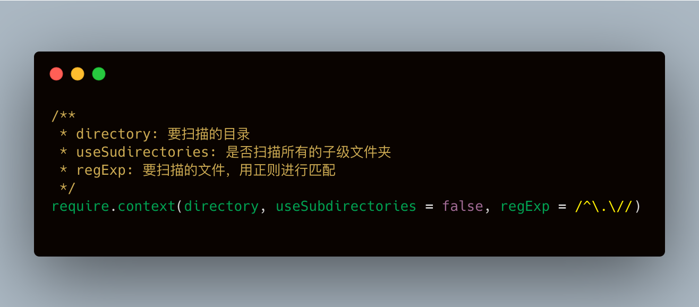
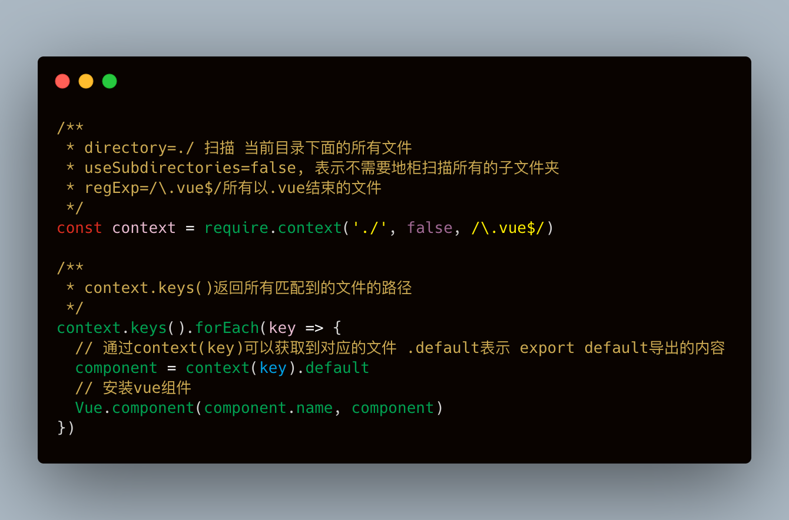
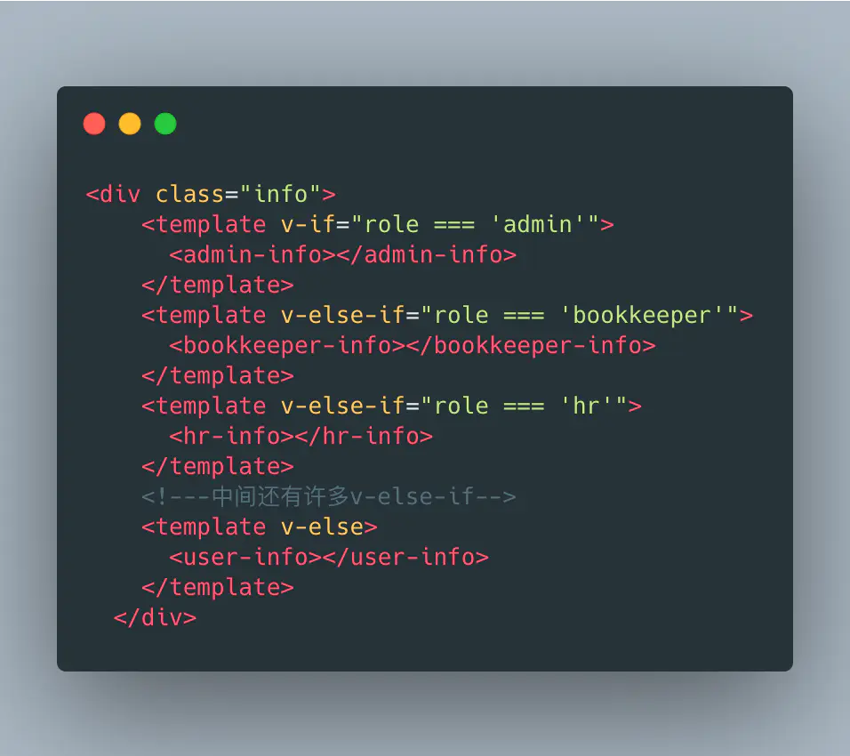
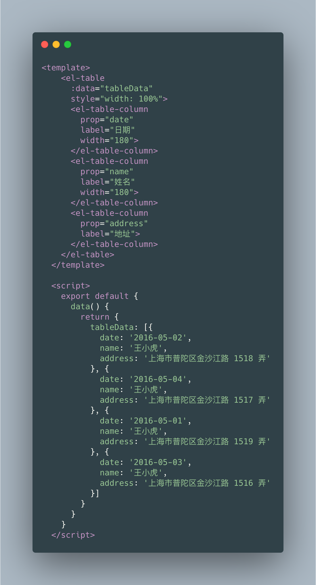

# 开发技巧(经验)

## fastClick的300ms延迟解决方案
开发移动端项目，点击事件会有300ms延迟的问题。这里只说下常见的解决思路，不管`vue`项目还是`react`项目，都可以使用`fastClick`解决。

```javascript
// main.js
import FastClick from 'fastclick'; // 引入插件
FastClick.attach(document.body); // 使用 fastclick
```

## 外部监听生命周期函数
`Vue`支持在外部监听组件的生命周期钩子函数

```javascript
<template>
  <!--通过@hook:updated监听组件的updated生命钩子函数-->
  <!--组件的所有生命周期钩子都可以通过@hook:钩子函数名 来监听触发-->
  <children @hook:updated="childrenUpdated" />
</template>
<script>
import Children from '../components/children'
export default {
  components: {
    Children
  },
  methods: {
    childrenUpdated() {
      console.log('children组件的updated钩子函数被触发')
    }
  }
}
</script>
```
## Vue main.js 文件中全局组件注册部分

在 \src\components\index.js 文件中export组件

```javascript
import HeaderList from './HeaderList'
import HeaderMenu from './HeaderMenu'
import HeaderPatient from './HeaderPatient'
import ExitUser from './ExitUser'
import TreePanel from './VueTree'
import TreeTable from './pc/TreeTable'
import TinymceText from './Tinymce'

export default {
  HeaderList,
  HeaderMenu,
  HeaderPatient,
  ExitUser,
  TreePanel,
  TreeTable,
  TinymceText
}
```
main.js中修改如下：

首字母替换成大写，加上小写字母v开头。

```javascript
import components from './components/' //加载公共组件

Object.keys(components).forEach((key) => {
  var name = key.replace(/(\w)/, (v) => v.toUpperCase())
  Vue.component('v'+name, components[key])
})
```
看完这个例子再看下一个例子，就更加的方便实用了。

## 使用require.context实现前端工程自动化

`require.context`是一个`webpack`提供的Api,通过执行`require.context函数`获取一个特定的上下文,主要是用于实现自动化导入模块。

什么时候用？ 当一个js里面需要手动引入过多的其他文件夹里面的文件时，就可以使用。

在Vue项目开发过程中，我们可能会遇到这些可能会用到`require.context`的场景

1、当我们路由页面比较多的时候，可能会将路由文件拆分成多个，然后再通过import引入到index.js路由主入口文件中

2、当使用`svg` `symbol`时候，需要将所有的svg图片导入到系统中（建议使用`svg-sprite-loader`）

3、开发了一系列基础组件，然后把所有组件都导入到index.js中，然后再放入一个数组中，通过遍历数组将所有组件进行安装。

对于上述的几个场景，如果我们需要导入的文件比较少的情况下，通过`import`一个一个去导入还可以接受，但对于量比较大的情况，就变成了纯体力活，而且每次修改增加都需要在主入口文件内进行调整。这时候我们就可以通过`require.context`去简化这个过程。

现在以上述第三条为例,来说明`require.context`的用法

常规用法



组件通过常规方式安装


`require.context`基本语法



通过`require.context`安装`Vue组件`



## 动态组件

显示不同的内容，写出不同权限对应的组件，然后再通过`v-if`来判断要显示哪个组件，一般会这么干



虽然是很直观，但是总觉得哪里不对劲，所以还是改成动态组件

```javascript
<template>
  <div class="info">
    <component :is="roleComponent" v-if="roleComponent" />
  </div>
</template>
<script>
import AdminInfo from './admin-info'
import BookkeeperInfo from './bookkeeper-info'
import HrInfo from './hr-info'
import UserInfo from './user-info'
export default {
  components: {
    AdminInfo,
    BookkeeperInfo,
    HrInfo,
    UserInfo
  },
  data() {
    return {
      roleComponents: {
        admin: AdminInfo,
        bookkeeper: BookkeeperInfo,
        hr: HrInfo,
        user: UserInfo
      },
      role: 'user',
      roleComponent: undefined
    }
  },
  created() {
    const { role, roleComponents } = this
    this.roleComponent = roleComponents[role]
  }
}
</script>
```

## 避免v-for与v-if混用

<font color=red>永远不要将v-for和v-if同时用在同一个元素上。</font>

开发vue项目中，我们会经常遇到这样的代码

```html
 <ul>
    <li v-for="item in list" v-if="item.visible" :key="item.id">
        {{ item.name }}
    </li>
 </ul>
```

如果在项目中启用了`eslint`，则可能会看到下面这样的异常提示(需要启用`eslint` `vue/no-use-v-if-with-v-for` 规则)

```javascript
The 'list' variable inside 'v-for' directive should be replaced with a computed property that returns filtered array instead. You should not mix 'v-for' with 'v-if'.
```

在vue处理指令的时候,`v-for`比`v-if`会有更高的优先级，那么上述的代码用js可以模拟为

```javascript
list.map(item => {
    if(item.visible) {
        return item.name
    }
})
```

通过上述代码可以看到，即使大部分数据的visible都是false,也会将整个list全部遍历一次。如果每一次都需要遍历整个数组，将会影响速度，尤其是当之需要渲染很小一部分的时候。

对于上述的问题，可以使用计算属性来处理

```javascript
<ul>
  <li v-for="item in getList" :key="item.id">
    {{ item.name }}
  </li>
</ul>
 
computed: {
  getList() {
    return this.list.filter(item => {
      return item.visible
    })
  }
}
```

通过上述的代码，我们可以获得以下好处

- 过滤后的列表只会在 list 数组发生相关变化时才被重新运算，过滤更高效。
- 使用 v-for="item in list" 之后，我们在渲染的时候只遍历需要显示的数据，渲染更高效。
- 解耦渲染层的逻辑,可维护性比较高


## 组件数据必须是一个函数，并返回一个对象

在说为什么组件的数据必须返回一个函数之前，我们先来了解一下js中的基本类型与引用类型

1、基本类型

在es2020发布了`bigint类型`之后，js中的基本类型一种包含七种，分别是

- string number boolean undefined null Symbol Bigint

基本类型的特点

- 基本类型的值是存放到栈内存里面的
- 基本类型的比较是它们的值的比较
- 基本类型的值是不可变的，对值的修改会在栈内存中开辟新的空间
- 基本类型上面不能挂载新的属性

```javascript
let a = 2
let b = a
// 对a的值的修改，会在栈内存开辟新的空间，所以不会影响到b的值
a = 3
// 输出 3 2
console.log(a,b)

// 不能给基本类型上面挂载新的属性
a.testProp = '挂载的属性'
// 输出undefined
console.log(a.testProp)
```

2、引用类型 在js中，除了以上基本类型，其他都属于引用类型，像`Object`, `Array`, `Function`, `RegExp`, `Date`等等

引用类型的特点

- 引用类型的值保存在堆内存中，而引用保存到栈内存中
- 引用类型的值是按引用访问的
- 引用类型的值是可变的（在堆内存中直接修改）
- 引用类型上面可以挂载新的属性

```javascript
let obj1 = {a: 1, b: 2}
let obj2 = obj1
// 因为引用类型的值是保存到堆内存的，obj1与obj2引用的是同一块堆内存空间，所以对obj1的值进行
// 修改，会直接影响到obj2的值
obj1.a = 3
// 输出 3
console.log(obj2.a)

// 挂载新的属性
obj1.testProp = '挂载的新属性值'
// 输出 "挂载的新属性值"
console.log(obj1.testProp)
```

<strong>假设我们现在开发了一个组件，组件上面的data是一个普通的对象，那么当我们实例化多个组件的时候，所有的实例将共享引用同一个数据对象，任何一个实例对数据的修改都会影响到其他实例。而将组件上面的数据定义为一个函数之后，当实例化多个组件的时候，每个实例通过调用 data 函数，从而返回初始数据的一个全新副本数据对象，这时候就避免了对象引用。</strong>


## 这些情况下不要使用箭头函数

- 不应该使用箭头函数来定义一个生命周期方法
- 不应该使用箭头函数来定义 method 函数
- 不应该使用箭头函数来定义计算属性函数
- 不应该对 data 属性使用箭头函数
- 不应该使用箭头函数来定义 watcher 函数

```javascript
watch: {
  obj: {
    handler:(val, oldVal) => { // 可以执行
      console.log("默认触发一次", val, oldVal);
    }
    deep: true
  }
}

// method：
methods: {
  plus: () => { // 可以执行
    // do something
  }
}

// 生命周期:
created:()=>{ // 可以执行
  // do something
}
```

没错，这些都能执行。

但是箭头函数绑定了父级作用域的上下文，`this` 将不会按照期望指向 `Vue 实例`。

也就是说，你不能使用`this`来访问你组件中的`data数据`以及`method方法`了。

`this`将会指向`undefined`。


## el-image-viewer(图片查看器)

这里要说的是`Element-ui`这个组件【Image](https://element.eleme.cn/#/zh-CN/component/image)

如果不使用`Image`组件又想使用预览大图的功能的话

- 使用方法

翻看`Image`的源码，发现大图预览是一个小组件`image-viewer`，打开看看它的`props`，如下

```javascript
props: {
  urlList: {
    type: Array,
    default: () => []
  },
  zIndex: {
    type: Number,
    default: 2000
  },
  onSwitch: {
    type: Function,
    default: () => {}
  },
  onClose: {
    type: Function,
    default: () => {}
  }
}
```

我们需要使用到的就只有`urlList`与`onClose`两个属性 ，一个用来放图片链接一个用来关闭查看器

然后我们就在代码里面引入`image-viewer`就可以直接使用

```javascript
<template>
  <div>
    <el-button @click="onPreview">预览</el-button>
    <el-image-viewer 
      v-if="showViewer" 
      :on-close="closeViewer" 
      :url-list="[url]" />
  </div>
</template>
<script>
// 导入组件
import ElImageViewer from 'element-ui/packages/image/src/image-viewer'

export default {
  name: 'Index',
  components: { ElImageViewer },
  data() {
    return {
      showViewer: false, // 显示查看器
      url:'https://cube.elemecdn.com/6/94/4d3ea53c084bad6931a56d5158a48jpeg.jpeg'
    }
  },
  methods: {
    onPreview() {
      this.showViewer = true
    },
    // 关闭查看器
    closeViewer() {
      this.showViewer = false
    }
}
</script>
```

## 调试 template

很多时候，我们会遇到 `template` 模板中变量报错的问题，这个时候，我们很想通过 `console.log` 打印到控制台，看它的值是什么


```javascript
// 这里最好是判断一下，只有在测试环境中才使用
// main.js
Vue.prototype.$log = window.console.log;

// 组件内部
<div>{{$log(info)}}</div>
```

## Vue.observable mini版本状态共享

当一个项目需求很小很小，完全不需要`vuex`的情况下，我们也就没有了安装`vuex`的必要

## 二次封装element-table

你是不是还在写这样的表格代码？


在后台管理系统如此高频率的使用表格增删改查中，每个表格页面都去单独的处理对应的列表数据，是不是很低效率，而且很面条代码，这个时候就可以引用二次封装的代码库，让代码更加简洁，高效

[lb-element-table](https://github.com/liub1934/lb-element-table)

使用方法：

在`src/components`目录中找到`lb-table`，复制到自己的项目中，然后引用，可以根据自己的需求自由更改。